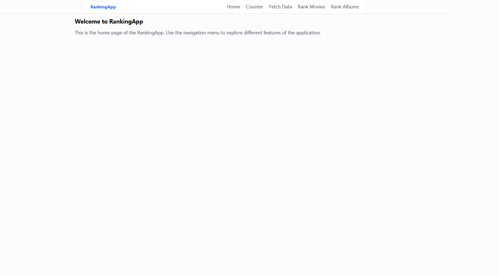

# 🎬 React + .NET Web API — Ranking App

Uma aplicação divertida e educativa onde podes **classificar filmes ou álbuns de música** arrastando-os para uma **grelha de ranking interativa**.  
Este foi o meu primeiro projeto a integrar **React (frontend)** com **.NET Web API (backend)** — desenvolvido para consolidar os meus conhecimentos de C# e ASP.NET Core.

---

## 🚀 Tecnologias Utilizadas

**Frontend**

- ⚛️ React (Hooks + Functional Components)
- 🎨 Tailwind CSS (estilização moderna e responsiva)
- 🧩 HTML5 Drag & Drop API
- 💾 LocalStorage (para persistência de dados)

**Backend**

- 🖥️ ASP.NET Core Web API (C#)
- 🌐 Endpoints RESTful para fornecer dados dos filmes e álbuns
- 📦 Estrutura baseada no template oficial “ASP.NET Core with React.js”

---

## ⚙️ Funcionalidades Principais

- 🪄 Arrasta e larga (drag & drop) filmes ou álbuns na grelha de ranking
- 🧮 Cada célula representa uma posição (Rank 1 a Rank 16)
- 🗂️ Dados guardados no LocalStorage para manter o estado
- 🔁 Botão de Reload que atualiza os dados a partir da API
- 📊 Tabela dinâmica com o ranking atual e imagens dos itens
- 🧱 Estrutura modular: componentes independentes e reutilizáveis
- 💅 Interface moderna com Tailwind CSS

---

## 🧠 O que Aprendi

- Como integrar um frontend React com um backend .NET
- Boas práticas de componentes React e gestão de estado com `useState` e `useEffect`
- Utilização de APIs nativas do navegador (drag & drop, local storage)

2️⃣ Abrir no Visual Studio 2022 (Community Edition)

-> Certifica-te de escolher o template “ASP.NET Core with React.js”
-> Executa o projeto com F5 (isto arranca backend + frontend juntos)

3️⃣ Navegar no browser

https://localhost:/

Poderás aceder às páginas:

-> /rank-movies — ranking de filmes
-> /rank-albums — ranking de álbuns
-> /counter e /fetch-data

💬 Créditos

Desenvolvido por Bruno Lopes

Projeto de aprendizagem com foco em .NET Web API e React, para consolidar conhecimentos
